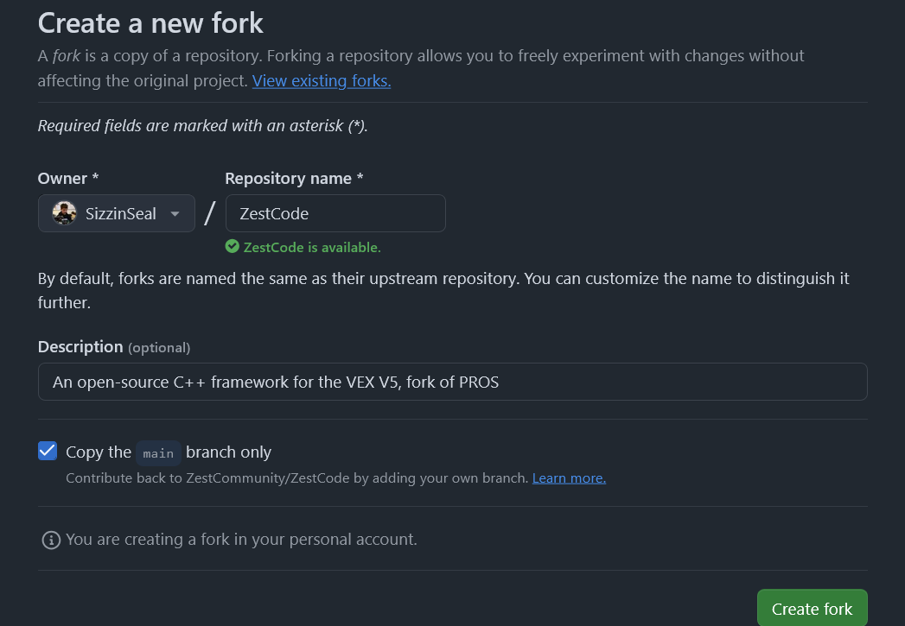
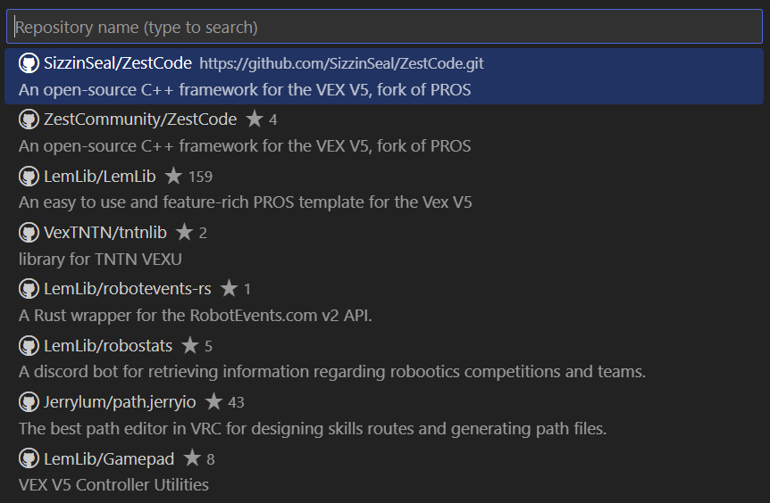

# Contributor's Guide

> [!TIP]
> Consider joining our [Discord Server](https://discord.gg/vNMXCvVwdY), it's the best place to discuss use/development of ZestCode.

First off, thanks for taking the time to contribute! ZestCode relies on people like **YOU** to stay bug-free and updated.

## Ways to contribute

### Bug Reports & Feature Requests

[Click Here](https://github.com/ZestCommunity/ZestCode/issues/new/choose) to submit a bug report, feature request, or privately report a security concern.

### Discussion

Discussion and decision making regarding the development of ZestCode happens mostly on the [ZestCode Discord server](https://discord.gg/vNMXCvVwdY).
Just asking questions, proposing new ideas, and sharing your thoughts make a positive impact.

### Pull Requests

Pull Requests (short form: "PRs") are used to make changes to ZestCode. The rest of this guide is dedicated to submitting a PR.

## Your First PR: a step-by-step guide

### Step 0: Choose what to work on

First, head on over to the [ZestCode Issues Tab](https://github.com/ZestCommunity/ZestCode/issues). Each title is prefixed with an emoji, which indicates the type of issue (see [Gitmoji](https://gitmoji.dev/)).

Each issue has a tag:
- **triage** - waiting on a maintainer to assign a tag
- **sub-issue** - this issue is part of a larger one
- **blocked** - this issue can't be worked on until other issue(s) are resolved
- **in-progress** - this issue is actively being worked on
- **ready** - this issue is ready to be worked on

You'll want to either submit a new issue which you might be able to work on, or you can select an existing issue marked "ready". [Click Here](https://github.com/ZestCommunity/ZestCode/labels/ready) for a list of all issues marked as "ready". Choose one you want to work on, we recommend something that doesn't sound too big or complicated for your first contribution.

### Step 1: Fork

> [!IMPORTANT]
> You'll need a GitHub account for this step.

[Click here](https://github.com/ZestCommunity/ZestCode/fork), then click the green button on the bottom right to create your fork, as shown in the image below.



After waiting a couple of seconds, you'll be redirected to your fork of ZestCode on GitHub.

### Step 2: Clone

> [!IMPORTANT]
> You'll need git, and [Visual Studio Code](https://code.visualstudio.com/) for this step.

In Visual Studio Code, open the command palette with (`ctrl+shift+p` or `command+shift+p`). Type `Git: Clone`, and hit enter. Select `Clone from GitHub`, and then click `<your_username_here>/ZestCode`.



### Step 3: Compile

> [!IMPORTANT]
> You'll need the [clangd](https://marketplace.visualstudio.com/items?itemName=llvm-vs-code-extensions.vscode-clangd) and [PROS](https://marketplace.visualstudio.com/items?itemName=sigbots.pros) VSCode extensions for this step

Once you have your ZestCode fork open in VSCode, you'll need to compile it so clangd (your linting tool) works properly. Open the PROS Integrated Terminal, and it should already be busy compiling. If not, run the following command:

```
make clean; pros build-compile-commands
```

It might take a while for the first build, but subsequent builds will be many times faster. After the build is done, open the command palette and run `clangd: Restart language server`. The linter should now be working properly.

### Step 4: Making your changes

The project file structure is explained in [STRUCTURE.md](./STRUCTURE.md). Read through it so you know where you should make your changes.
Details on the code style can be found in [STYLEGUIDE.md](./STYLEGUIDE.md).

You should commit changes regularly. This isn't a requirement, but it will make your life easier, especially for more complex PRs.
You should also be testing your code regularly, and write tests for it in the `src/tests` folder if needed.

### Step 5: Open a PR

Once you think your PR is ready to be reviewed, go to your fork on GitHub, and click the "contribute" button, as shown below

[contribute button](./assets/contributing/contribute.png)